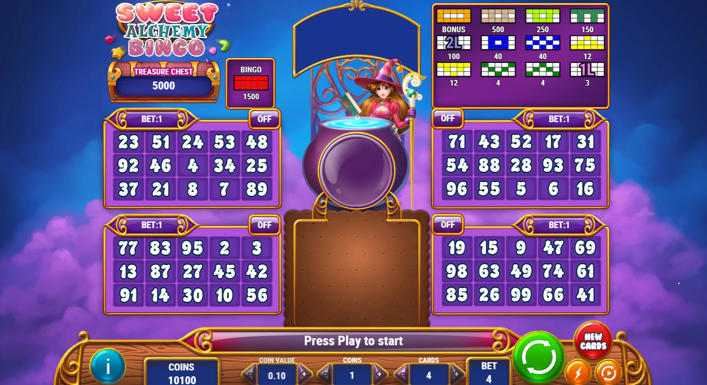
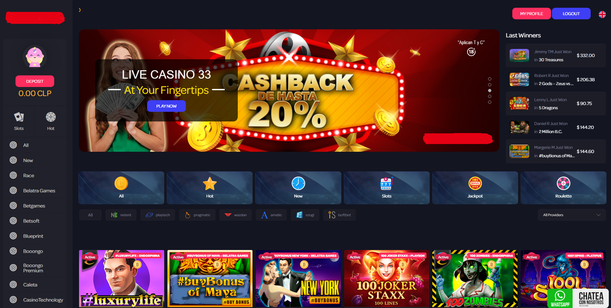

## 👋 Welcome to my profile!   

<!--
**cmate5614530/cmate5614530** is a ✨ _special_ ✨ repository because its `README.md` (this file) appears on your GitHub profile.

Here are some ideas to get you started:

- 🔭 I’m currently working on ...
- 🌱 I’m currently learning ...
- 👯 I’m looking to collaborate on ...
- 🤔 I’m looking for help with ...
- 💬 Ask me about ...
- 📫 How to reach me: ...
- 😄 Pronouns: ...
- ⚡ Fun fact: ...
-->
<!---->

<!-- ### About Me
- As a full stack developer with Web2 & Web3, I have been doing my best to give clients only satisfied results.
- I always keep learning trending & innovative technologies/skills.
- I will make your great idea live.
- I work full time and prefer long-term collaboration.
- You can [send mail](mailto:cmate5614530@gmail.com) or contact me via [skype](https://join.skype.com/invite/fm0GRG34ND1D)
### My Skills  -->
I have been dealing with Sports Betting and Online Casino System for years.  
Welcome for anyone wants to build own bookie and all-in-one system.  
I have strong skills with both website and webapp(PWA) development.  
  
✔ ReactJS(MaterialUI, AntD, MDB, Next.js, Redux...),  
✔ VueJS(VueX, Vuetify, Nuxt..),  
✔ NodeJS/Express,  
✔ Laravel(v5, v6, v7, v8), CodeIgniter  
✔ CRM/ERP : Zoho(One, Creator, Analytics, Campaign...), Netsuite, Salesforce, Perfex, Suite/Sugar  
✔ CMS : WordPress/WooCommerce  
✔ MySQL/MariaDB, NoSQL/MongoDB, PostgreSQL, SQLite, Google Firebase, Redis    

<!-- 
 -->

