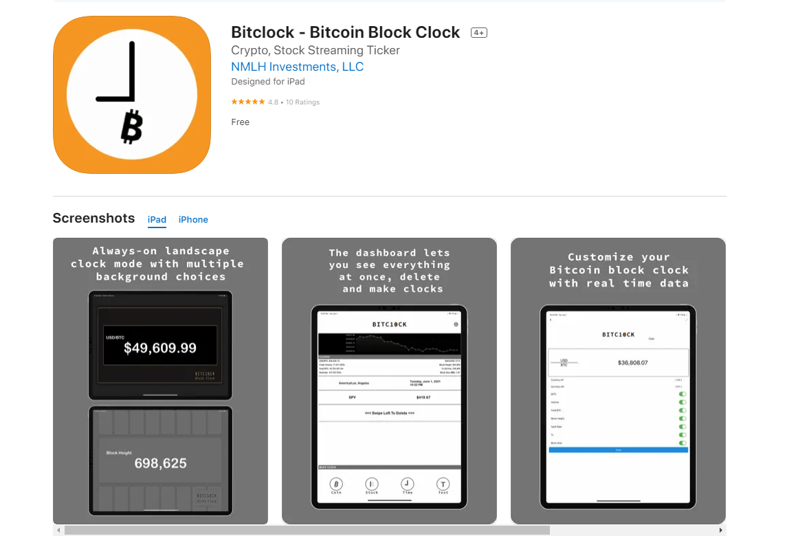

## 👋 Welcome to my profile!   

<!-- ### About Me
- As a full stack developer with Web2 & Web3, I have been doing my best to give clients only satisfied results.
- I always keep learning trending & innovative technologies/skills.
- I will make your great idea live.
- I work full time and prefer long-term collaboration.
- You can [send mail](mailto:cmate5614530@gmail.com) or contact me via [skype](https://join.skype.com/invite/fm0GRG34ND1D)
### My Skills  
As a professional full stack developer, I have been dealing with Sports Betting and Online Casino System for years.  
Welcome for anyone wants to build own bookie and all-in-one system.  

I have strong skills with both website and webapp(PWA) development.  

You can [send mail](mailto:cmate5614530@gmail.com) or contact me via [skype](https://join.skype.com/invite/fm0GRG34ND1D) -->

✔ ReactJS(MaterialUI, AntD, MDB, Next.js, Redux...),  
✔ VueJS(VueX, Vuetify, Nuxt..),  
✔ NodeJS/Express,  
✔ Laravel(v5, v6, v7, v8), CodeIgniter  
✔ Flutter, Swift  
✔ CRM/ERP : Zoho(One, Creator, Analytics, Campaign...), Netsuite, Salesforce, Perfex, Suite/Sugar  
✔ CMS : WordPress/WooCommerce  
✔ MySQL/MariaDB, NoSQL/MongoDB, PostgreSQL, SQLite, Google Firebase, Redis    

<!-- 
 

### - Sports Betting / Online Casino System

  
  
  
  
  
  
  
   
  
  
  
  
  
  
  
  

### - Booking System

  
  
  
  

### - A/B Testing System

  
  
  
  

### - Mobile App(Swift/Flutter)

  
  
  

-->
